# SchedNara - An Aranara Workflow and Scheduling App

  

**Name:** Ella Raputri

**Class:** L2AC

**Student ID:** 2702298154

 

## Project Description
SchedNara is an abbreviation of Schedule of Nara. Nara is what the Aranaras in Genshin call humans. So, SchedNara is the schedule of humans, or to be exact, the schedule of the user.
SchedNara is used to set the tasks and workflows of the user. Besides that, it also allows the user to interact with some Aranaras and ask them some trivial things. 

 

## Documentation and Poster
To access the documentation and the poster, please refer to the 'document' folder inside this repository

 

## Most Libraries or Packages Used
- AWT and Swing - for creating the GUI
- java.sql - to insert or query the data from the database
- java.time - to parse the time and date used in the program
- javax.sound - for playing the background music and sound effects
- There are many other packages, libraries or APIs used in this project, please kindly refer to the 'OOP Final Project Report' inside the 'document' folder to see the details.

 

## Files (inside the 'src' folder)
- 'sound' folder, contains the background music and the sound effects for this program.
- 'img' folder, contains all of the program picture assets. 

 

## Features and Screenshots

&ensp;<b>Welcome Page</b>

- Welcome Page is the first page that the user accesses when opening this app.

- From here, the user can choose to Sign Up or Login.

- Here are some images of this page:

  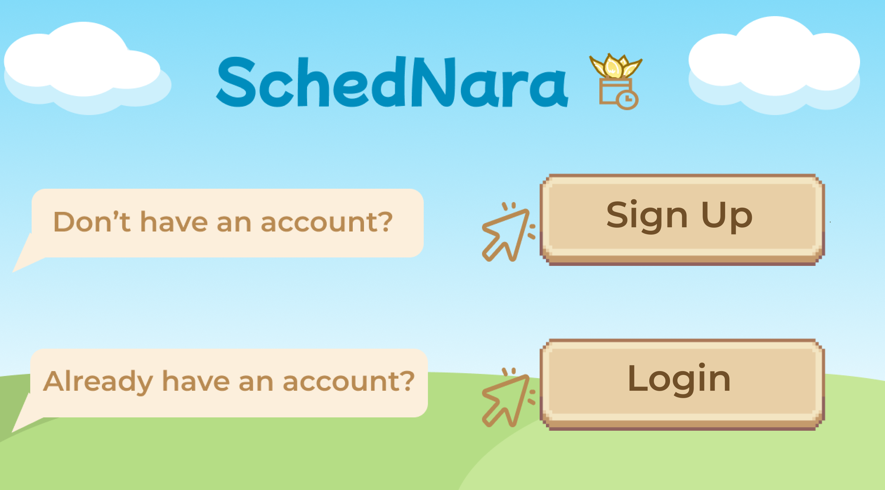 

  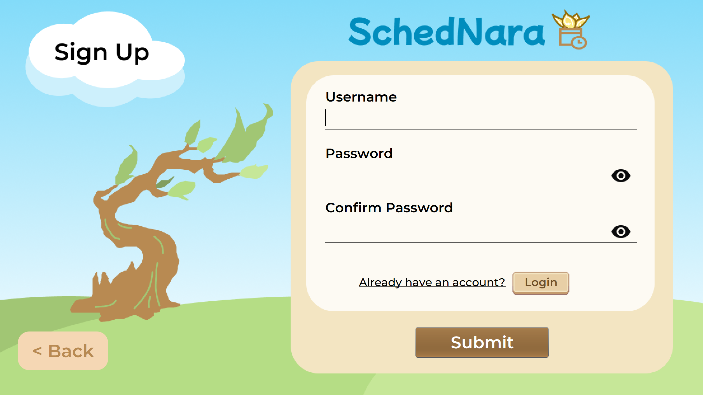 

  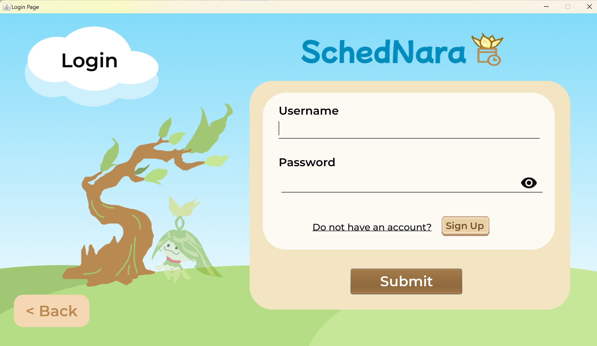

 

&ensp;<b>Home Page</b>

- Home Page is the landing page after the user has signed up or login to their account.

- Here, the user can view the task completion chart, their default Aranara, their upcoming tasks for today, and a random quote. User can also navigates to other menus through the side navigation bar.

- Here are the image of this page:

  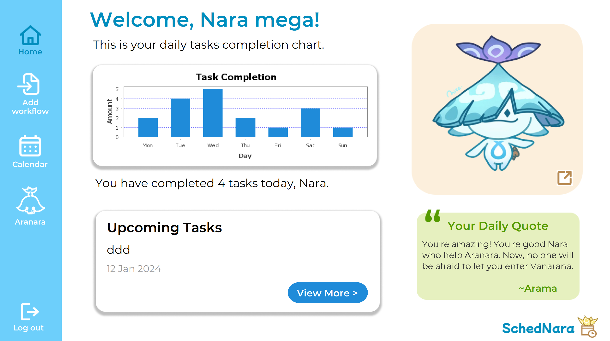

 

&ensp;<b>Add Workflow Menu</b>

- Add Workflow Menu is the menu for the user to edit their workflows.

- Here, user can choose to:
    - Add, edit, and delete workflow
    - Add, edit, and delete the flows inside the workflow
    - Generate the workflow flows into date (text)

- Here are some images of this page:

  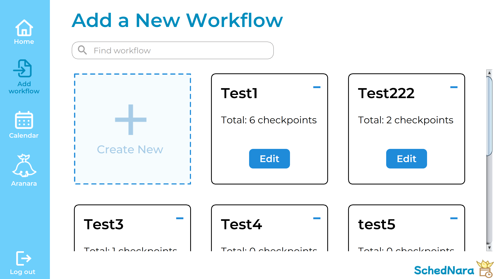 

  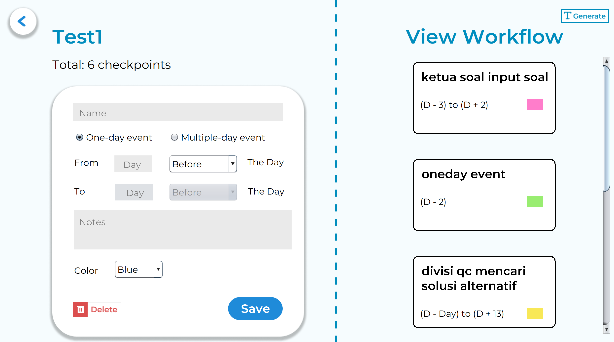 

  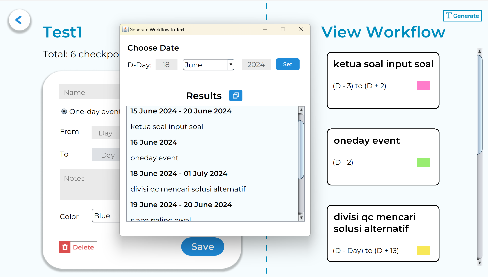

 

&ensp;<b>Calendar Page</b>

- Calendar Page is the page for the user to see their tasks in the calendar.

- Here, user can choose to:
    - Add, edit, and delete tasks
    - Set the task to be completed
    - Insert workflow's flows as tasks to the calendar
    - Contact other people in WhatsApp with the contact list and the message templates
    - Add, edit, and delete contacts and message templates

- Here are some images of this page:

  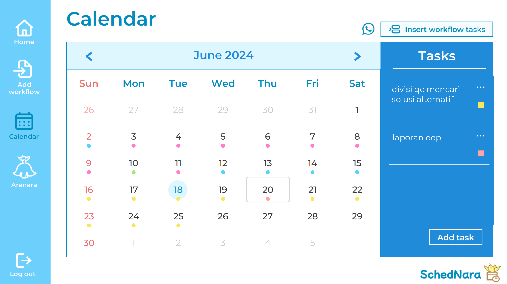 

  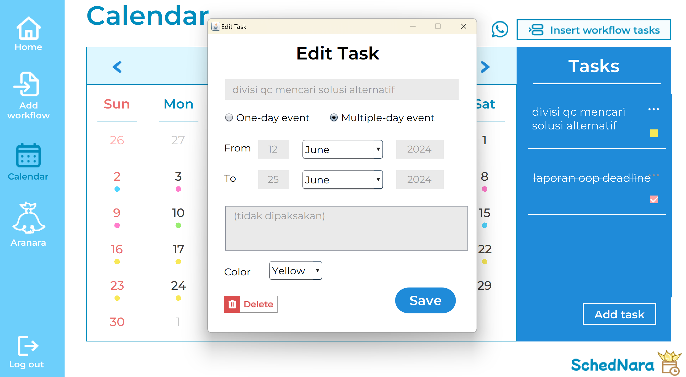 

  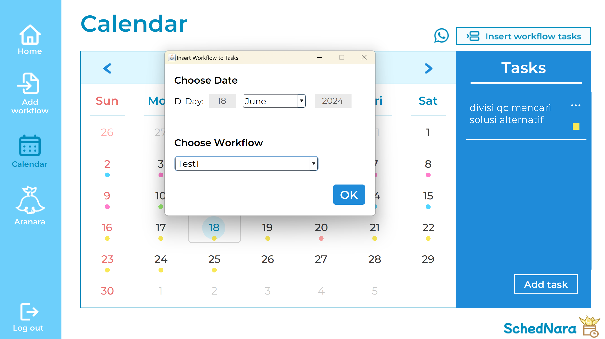 

  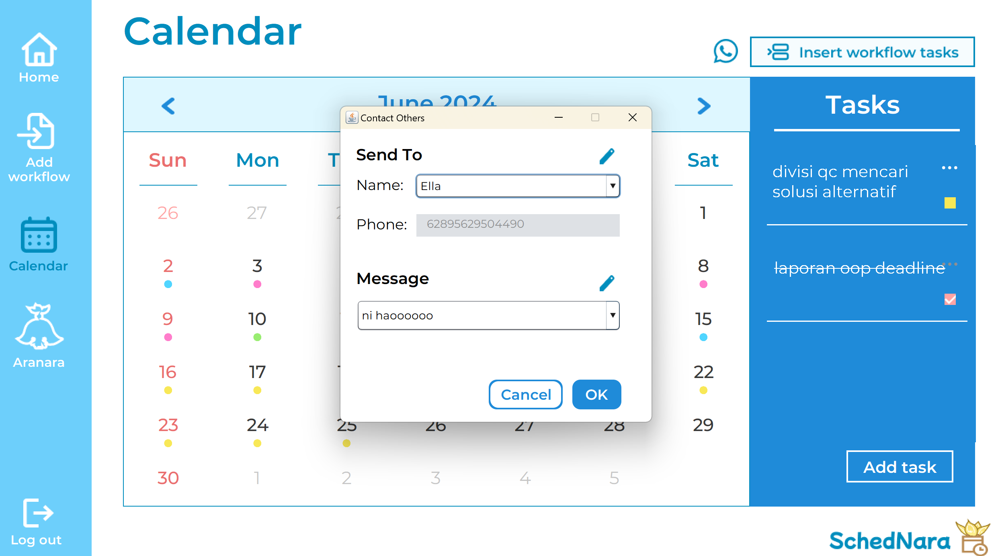

 

&ensp;<b>Aranara Menu</b>

- Aranara menu is the menu for the user to visit the Aranara and interact with them.

- Here, user can choose to:
    - Interact with the Aranara
    - Ask trivial things about task, weather, etc. from the Aranara
    - Change the background music by changing the default Aranara

- Here are some images of this page:

  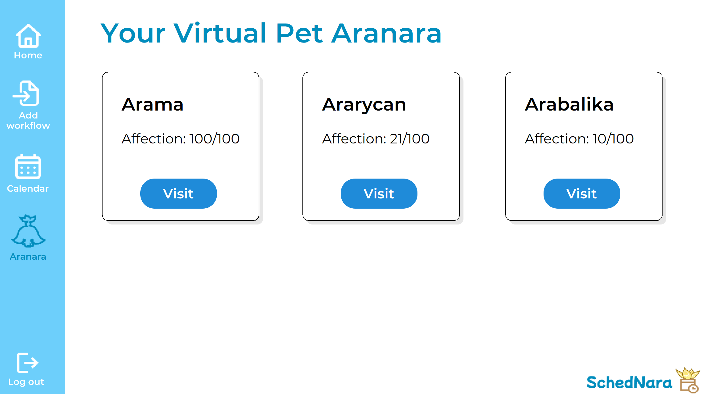 

  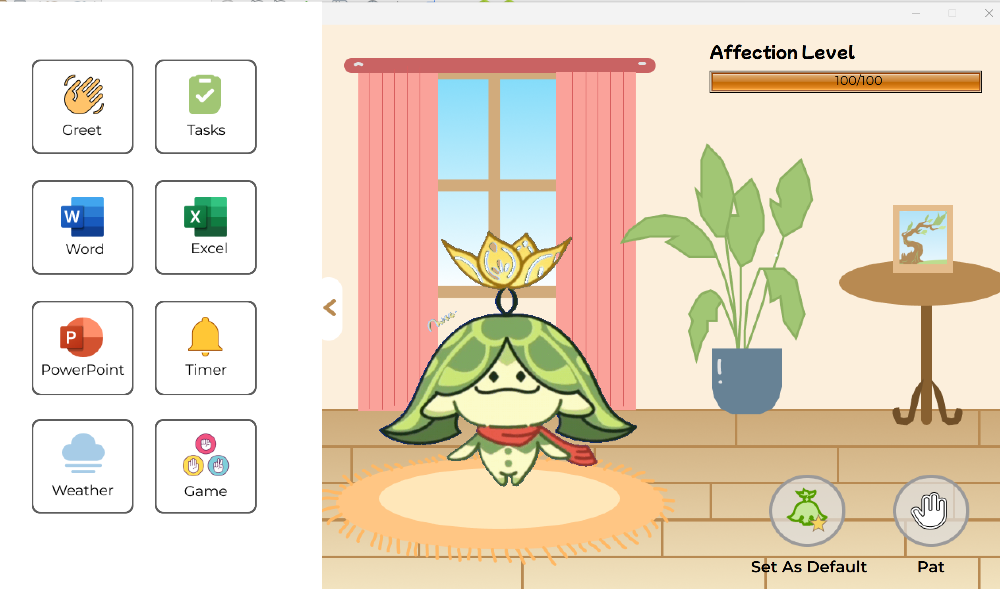

 

